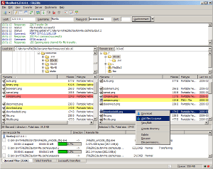
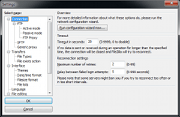
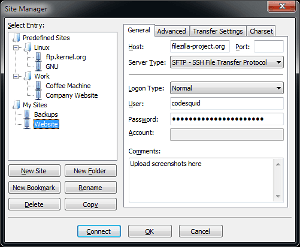

# FileZilla.js

FileZilla.js®, the free FTP solution written with Electron. The FileZilla Client not only supports FTP, but also FTP over TLS (FTPS) and SFTP.

[](docs/images/fz3_win_main.png)

[](docs/images/fz3_win_settings.png)

[](docs/images/fz3_win_sitemanager.png)

## Features

Among others, the features of FileZilla include the following:

* Easy to use
* Supports FTP, FTP over SSL/TLS (FTPS) and SSH File Transfer Protocol (SFTP)
* Cross-platform. Runs on Windows, Linux, *BSD, macOS and more 
* IPv6 support
* Available in many languages **TODO**
* Supports resume and transfer of large files >4GB **TODO**
* Tabbed user interface **TODO**
* Powerful Site Manager and transfer queue **TODO**
* Bookmarks **TODO**
* Drag & drop support **TODO**
* Configurable transfer speed limits **TODO**
* Filename filters **TODO**
* Directory comparison **TODO**
* Keep-alive **TODO**
* HTTP/1.1, SOCKS5 and FTP-Proxy support **TODO**
* Flatpack support on Linux **TODO**

## To Use

To clone and run this repository you'll need [Git](https://git-scm.com) and [Node.js](https://nodejs.org/en/download/) (which comes with [npm](http://npmjs.com)) installed on your computer. From your command line:

```bash
# Clone this repository
git clone https://github.com/jeanfleblanc/filezilla.js
# Go into the repository
cd filezilla.js
# Install dependencies
npm install
# Run the app
npm start
```

Note: If you're using Linux Bash for Windows, [see this guide](https://www.howtogeek.com/261575/how-to-run-graphical-linux-desktop-applications-from-windows-10s-bash-shell/) or use `node` from the command prompt.

## Resources for Learning Electron

- [electronjs.org/docs](https://electronjs.org/docs) - all of Electron's documentation
- [electronjs.org/community#boilerplates](https://electronjs.org/community#boilerplates) - sample starter apps created by the community
- [electron/electron-quick-start](https://github.com/electron/electron-quick-start) - a very basic starter Electron app
- [hokein/electron-sample-apps](https://github.com/hokein/electron-sample-apps) - small demo apps for the various Electron APIs

## License

[CC0 1.0 (Public Domain)](LICENSE.md)
